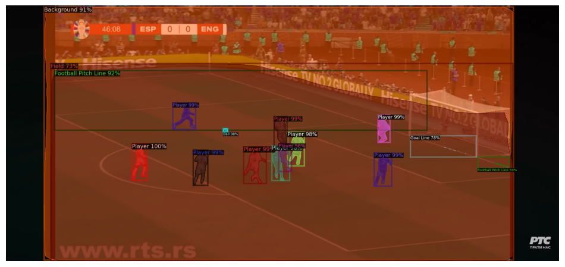
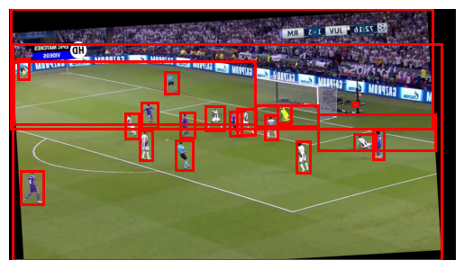

#  Instance Segmentation

This project implements and compares **Mask R-CNN** and **Cascade Mask R-CNN** for instance segmentation on football match footage. The goal is to detect and segment objects like players, referees, the ball, and field elements on a pixel level enabling applications in sports analytics and computer vision research.

---

##  Dataset

- Extracted frames from **3 football match videos**  
- Total: **810 annotated images**  
- Split: **70% train / 10% val / 20% test**  
- Frames split by **scenes** (not randomly) to avoid data leakage  
- Annotations include **masks and bounding boxes** for all object classes

---

##  Evaluation Metrics

- **mAP (Mean Average Precision):** mean AP over IoU thresholds [0.05–0.95]  
- **mAR (Mean Average Recall):** mean recall per class across IoUs  
- **IoU (Intersection over Union):** overlap between predicted and ground truth masks

---

##  Models

###  Mask R-CNN
- Backbone: **ResNet-50 + FPN**  
- Optimizer: **SGD → Adam** (improved convergence)  
- Improvements:
  - Added smaller anchors for small objects (e.g., ball)  
  - Tuned RPN region proposals  
  - Increased training to **10 epochs**  
- Result: Noticeable improvement in small-object detection and overall mAP
- mAP: **0.70**
- mAP_50 : **0.93**
- mAP_75 : **0.82**
- mAP_small : **0.14** 

---

###  Cascade Mask R-CNN (Detectron)
- Multi-stage refinement for more precise detection and masks  
- Hyperparameters tuned automatically with **Optuna**  
- Final model trained on combined train + validation sets  

**Bounding Box Results:**  
- mAP: **76.35**  
- AP50: **91.44**  
- AP75: **84.44**  
- AP (small): 43.40 | AP (medium): 83.25 | AP (large): 76.74  

**Segmentation Results:**  
- mAP: **48.53**  
- AP50: **64.38**  
- AP75: **52.37**  
- AP (small): 12.02 | AP (medium): 30.35 | AP (large): 69.28  

 Large objects (field, background) are segmented with high precision  
 Small objects (ball, thin lines) remain challenging

---

##  Data Augmentation

To improve generalization, we used **Albumentations** to double the dataset size:

- `ShiftScaleRotate` – ±6.25% shift, ±10% scale, ±5° rotation  
- `HorizontalFlip` – 50% probability  
- `RandomSizedCrop` – resize to 1920×1080  
- `RandomBrightnessContrast` – ±20% brightness/contrast  

This significantly improved performance, especially for medium-sized objects.

---

## Results Overview

| Model | mAP (BBox) | mAP (Segm) | AP Ball | AP Player |
|-------|------------|------------|----------|-----------|
| Mask R-CNN (tuned) | **0.70** | - | **~0.20** | **0.68** |
| Cascade Mask R-CNN | **76.35** | **48.53** | 41.28 | **0.80** |

-  Large objects are segmented with very high precision  
-  Small objects remain the hardest to detect

---

##  Key Takeaways

- Iterative model refinement and better data handling significantly improved results.  
- **Cascade Mask R-CNN** achieved the best overall performance.  
- Further improvements: solving refree prediction problem for maskRCNN, larger dataset, stronger augmentations, and loss reweighting for small objects.

---

##  References
- [Mask R-CNN](https://arxiv.org/abs/1703.06870)  
- [Feature Pyramid Networks](https://arxiv.org/abs/1612.03144)  
- [Stanford CS231n](https://cs231n.stanford.edu/)  
- [Albumentations Guide](https://www.kaggle.com/code/blondinka/how-to-do-augmentations-for-instance-segmentation)  
- [mAP Explained](https://learnopencv.com/mean-average-precision-map-object-detection-model-evaluation-metric/)  

---

 **Authors:** Marko Nikitović & Kristijan Petronijević  
 Faculty of Mathematics, University of Belgrade
